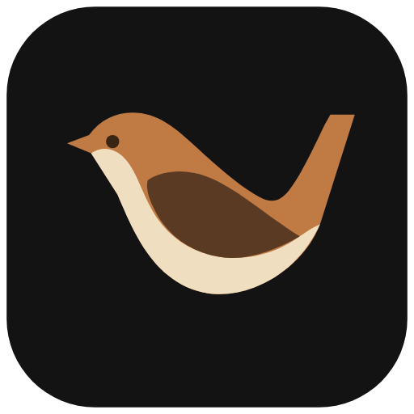

<h2 align="center">
  <br>
  
  <br>
  <br>
  <div align="center">Wren Companion</div>
  <br>
</h2>

Wren Companion connects browser dapps to the
[Wren](https://github.com/jorphex/wren) desktop wallet. It is derived from the
original [Frame extension](https://github.com/frame-labs/frame-extension) under
GPL-3.0 and is not affiliated with or endorsed by Frame Labs.

Companion `0.1.0` speaks authenticated protocol 2. It supports the minimum
desktop commit recorded in `compatibility.json` and later Wren releases that
retain protocol 2; desktop releases do not require new companion submissions.

Some internal `frame_*` protocol labels and the `isFrame` provider flag remain
for compatibility with existing desktop releases and dapps. Public discovery
uses the Wren name and `io.github.jorphex.wren` reverse-domain identifier.

### Build

```bash
# Clone
› git clone https://github.com/jorphex/wren-companion

# Use the pinned Node version
› nvm install
› nvm use

# Install, check and build
› npm run setup:ci
› npm run verify
```

### Install

Use only a companion build paired with the minimum Wren desktop commit recorded
in its `*-compatibility.json` artifact. Published archives include checksums, a
production SBOM, and Firefox reviewer source; see the [release
procedure](RELEASE.md).

To create the browser archives locally:

```bash
› npm run package:browsers
› npm run package:verify
```

Extract the browser ZIP before installation. Chrome and Firefox packages use
browser-specific background manifests and must not be interchanged.

1. Go to `brave://extensions` or `chrome://extensions`
2. Turn developer mode on if not already active (top-right corner)
3. Tap "Load unpacked"
4. Select the extracted archive directory, or `dist/` when installing a local build

For Firefox, open `about:debugging#/runtime/this-firefox`, select "Load Temporary
Add-on", and choose `manifest.json` at the extracted archive root, or
`dist/manifest.json` for a local build.

On first connection, compare and approve the six-digit pairing code in both
Wren and the extension. Wren can revoke a paired credential and the extension
settings can reset it. Pairing authenticates the extension to Wren; it does not
authenticate the localhost Wren endpoint to the extension. See the
[security policy](SECURITY.md) for the complete boundary.

Release candidates can be exercised with the local, dependency-free
qualification page by running `npm run qualify:serve`. It binds only to
`127.0.0.1`; follow the paired desktop [qualification
procedure](https://github.com/jorphex/wren/blob/main/QUALIFICATION.md)
and use disposable test accounts only.

The companion has no telemetry or remote code. Its local data handling is
documented in the [privacy policy](PRIVACY.md), and store submission material is
maintained in [STORE_SUBMISSION.md](STORE_SUBMISSION.md).

### Related

- [Wren](https://github.com/jorphex/wren) - Desktop EVM wallet and system-wide provider
